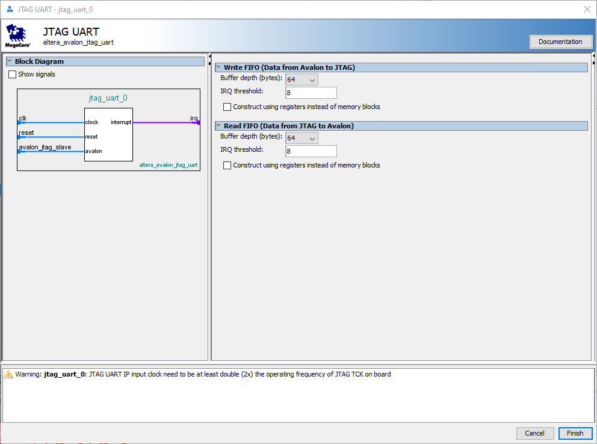
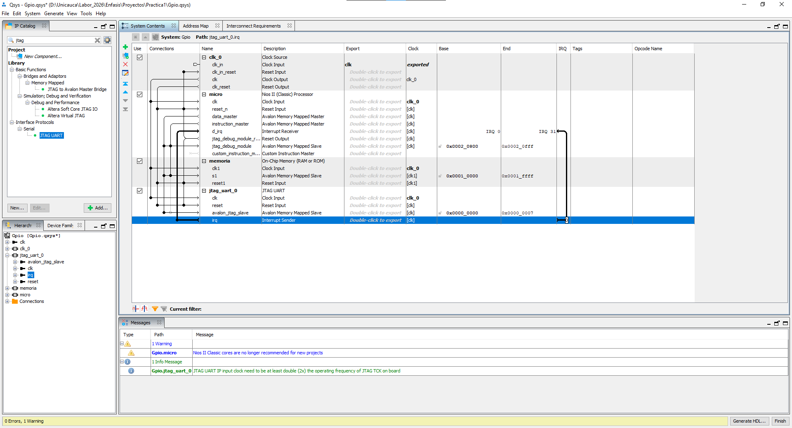
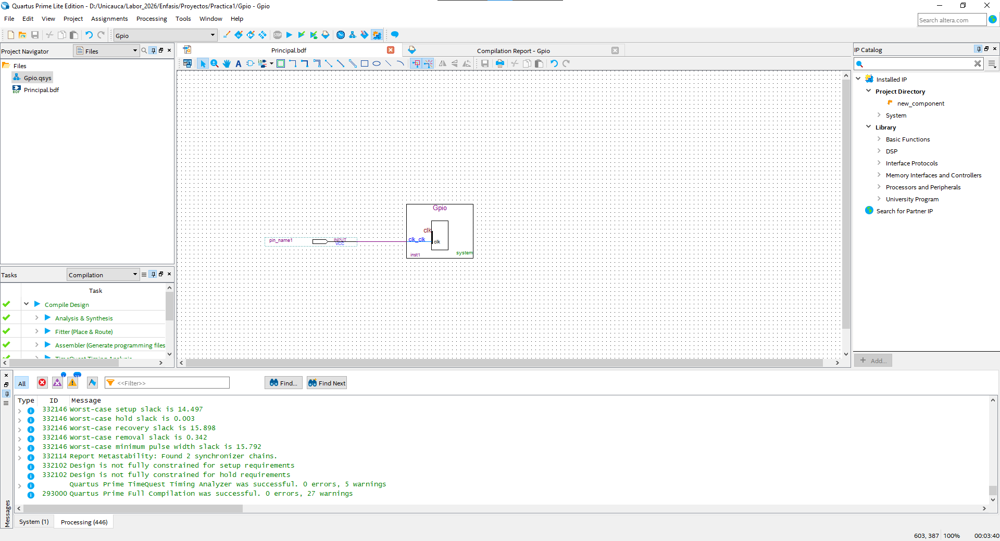
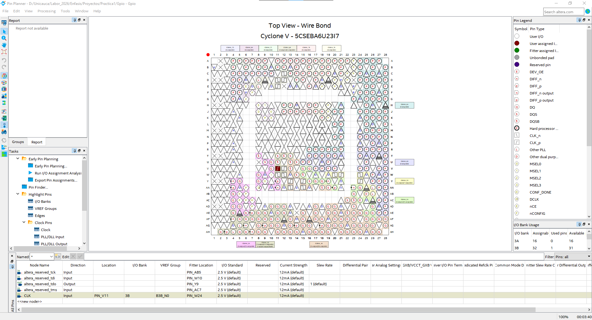
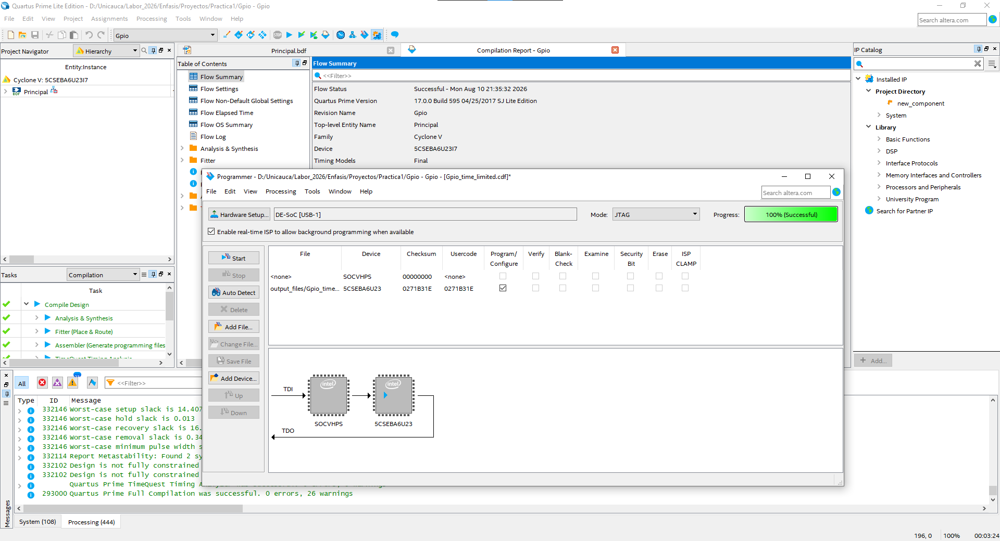

# Guía completa organizada — DE0-Nano-SoC / Nios II / JTAG UART / HPS

> **Objetivo:** documentar paso a paso la construcción del sistema `Gpio` en Platform Designer/Qsys, explicar qué hace cada componente, por qué se conecta, por qué algunos puertos permanecen sin conectar, cómo interpretar los errores y cómo generar finalmente el HDL.

---

## Mapa cronológico de los pasos

| Paso | Imagen | Etapa | Resultado esperado |
|---:|---|---|---|
| 1 | — | Crear proyecto y abrir Platform Designer/Qsys | Sistema inicial |
| 2 | `01_qsys_niosii_con_errores.png` | Agregar/configurar Nios II | Componentes visibles |
| 3 | — | Configurar `clk_0` | Nios II y memoria con reloj |
| 4 | — | Configurar reset | Nios II y memoria con reset |
| 5 | — | Conectar `instruction_master` | Nios II puede leer instrucciones |
| 6 | — | Conectar `data_master` | Nios II puede acceder a datos |
| 7 | `03_onchip_memory_configuracion.png` | Configurar On-Chip Memory | Memoria definida |
| 8 | `04_onchip_memory_avalan_s1.png` | Conectar `memoria.s1` | Avalon-MM válido |
| 9 | `05_qsys_inicial_con_errores.png` | Configurar Reset/Exception Vector | Errores estructurales corregidos |
| 10 | `02_address_map_sin_errores.png` | Revisar Address Map | Sin overlaps |
| 11 | `06_generate_hdl.png` | Generate HDL | HDL generado |
| 12 | `paso12.png` | Configurar JTAG UART | FIFO/IRQ/reloj configurados |
| 13 | `paso13.png` | Verificar Platform Designer completo | Nios II + memoria + JTAG UART + Avalon |
| 14 | `paso14.png` | Integrar y compilar en Quartus | Compilación sin errores |
| 15 | `paso15.png` | Pin Planner | Pines físicos asignados |
| 16 | `paso16.png` | Programmer / JTAG / SOCVHPS | FPGA programada correctamente |

> **Importante:** los números de las secciones detalladas del documento son internos. La tabla anterior es la **secuencia cronológica de la práctica** y es la que debe utilizarse para relacionar las capturas `paso12.png`–`paso16.png` (nombres reales en `img/`). Las columnas "Imagen" de los pasos 2, 7–11 usan los nombres originales de este documento (`01_...png`…`06_...png`), que nunca existieron como archivos aparte — ver la sección 61 para la equivalencia con las capturas reales del proyecto. Las imágenes reales corresponden al mismo sistema `Gpio` sobre Cyclone V `5CSEBA6U23I7` documentado en las secciones 1–48; no a una tarjeta DE0-Nano-SoC distinta.

---

# 1. Introducción

Platform Designer, anteriormente conocido como Qsys, permite construir un sistema digital compuesto por procesadores, memorias, relojes y periféricos dentro de una FPGA.

En esta práctica se está construyendo un sistema basado en:

```text
                    ┌────────────────────┐
                    │       clk_0        │
                    │   Clock Source     │
                    └─────────┬──────────┘
                              │
                              │ CLK
             ┌────────────────┴────────────────┐
             │                                 │
             ▼                                 ▼
      ┌──────────────┐                  ┌──────────────┐
      │    micro     │                  │   memoria    │
      │   Nios II    │◄──── Avalon ────►│ On-Chip RAM  │
      └──────┬───────┘                  └──────────────┘
             │
             │ JTAG
             ▼
      ┌──────────────┐
      │ JTAG Debug   │
      │    Module    │
      └──────────────┘
```

La idea fundamental es:

1. El **Clock Source** genera el reloj.
2. El **Reset** coloca los componentes en un estado conocido.
3. **Nios II** ejecuta el programa.
4. **On-Chip Memory** almacena el programa y los datos.
5. Los buses **Avalon-MM** permiten que Nios II acceda a la memoria.
6. El **JTAG Debug Module** permite depurar y cargar software.
7. El **Address Map** asigna direcciones a los componentes.

---

# 2. Componentes utilizados

| Componente | Función |
|---|---|
| `clk_0` | Generar el reloj del sistema |
| `micro` | Procesador Nios II |
| `memoria` | Memoria interna de la FPGA |
| `memoria.s1` | Interfaz Avalon Memory-Mapped de la memoria |
| `data_master` | Acceso del procesador a datos/periféricos |
| `instruction_master` | Acceso del procesador a instrucciones |
| `d_irq` | Entrada de interrupciones |
| `custom_instruction_master` | Interfaz para instrucciones personalizadas |
| `jtag_debug_module` | Depuración mediante JTAG |
| `reset_n` | Reset del procesador |
| `reset1` | Reset de la memoria |

---

# 3. Primera configuración de Qsys

## Imagen 1 — Sistema Nios II con errores


### ¿Qué muestra esta imagen?

En la imagen aparece el sistema `Gpio` dentro de Platform Designer.

Se observan:

- `clk_0`
- `micro`
- `memoria`
- `micro.data_master`
- `micro.instruction_master`
- `micro.d_irq`
- `micro.jtag_debug_module`
- `micro.jtag_debug_module_reset`
- `micro.custom_instruction_master`
- `memoria.s1`
- `memoria.clk1`
- `memoria.reset1`

En la parte inferior aparecen errores porque todavía existen conexiones y configuraciones incompletas.

### ¿Por qué aparecen los errores?

Porque Platform Designer comprueba que cada componente tenga las señales obligatorias correctamente conectadas.

Por ejemplo:

```text
micro.clk
micro.reset_n
memoria.clk1
memoria.reset1
```

deben tener conexiones válidas.

Además, el procesador necesita saber dónde se encuentran:

- su memoria de programa;
- su memoria de excepciones;
- sus periféricos.

---

# 4. Clock Source — `clk_0`

El primer elemento fundamental es el reloj.

```text
                    clk_0
                      │
              ┌───────┴───────┐
              │               │
              ▼               ▼
          micro.clk       memoria.clk1
```

## ¿Qué hace?

`clk_0` produce los pulsos que sincronizan el funcionamiento del sistema.

Un procesador digital no puede ejecutar correctamente sus operaciones sin una señal de reloj.

## ¿Por qué se conecta a Nios II?

Porque Nios II necesita un reloj para ejecutar instrucciones.

```text
clk_0.clk
    │
    ▼
micro.clk
```

## ¿Por qué se conecta a la memoria?

La memoria también necesita operar sincronizada con el sistema.

```text
clk_0.clk
    │
    ▼
memoria.clk1
```

---

# 5. Error relacionado con el Clock

Un error típico mostrado inicialmente fue:

```text
micro.clk must be connected to a clock output
```

Esto significa:

> El reloj del procesador no tiene una fuente válida.

También puede aparecer:

```text
memoria.clk1 must be connected to a clock output
```

La solución conceptual es:

```text
clk_0.clk
   ├────────► micro.clk
   │
   └────────► memoria.clk1
```

No hay que conectar una señal de reloj arbitrariamente. Debe provenir de un **Clock Source**.

---

# 6. Nios II — `micro`

## ¿Qué es?

`micro` es el procesador Nios II.

Su función es ejecutar el programa que posteriormente se desarrollará para la FPGA.

Conceptualmente:

```text
                 Nios II
             ┌─────────────┐
             │             │
             │   CPU       │
             │             │
             └──────┬──────┘
                    │
          ┌─────────┴─────────┐
          │                   │
          ▼                   ▼
 instruction_master      data_master
```

El procesador necesita dos tipos de acceso importantes:

- instrucciones;
- datos.

---

# 7. `instruction_master`

## ¿Qué hace?

`instruction_master` es el maestro Avalon que utiliza Nios II para buscar las instrucciones que debe ejecutar.

```text
Nios II
   │
   │ instruction_master
   ▼
memoria.s1
```

Por ejemplo, si el programa contiene:

```c
int main()
{
    ...
}
```

las instrucciones compiladas terminan almacenadas en memoria y Nios II debe leerlas.

## ¿Por qué se conecta?

Porque sin acceso a la memoria de instrucciones, Nios II no tendría de dónde obtener el código que debe ejecutar.

---

# 8. `data_master`

## ¿Qué hace?

`data_master` permite que Nios II realice accesos de datos.

```text
Nios II
   │
   │ data_master
   ▼
memoria.s1
```

Puede utilizarse para:

- leer variables;
- escribir variables;
- acceder a memoria;
- acceder a periféricos Memory-Mapped.

En un sistema sencillo es perfectamente posible que `instruction_master` y `data_master` utilicen la misma On-Chip Memory.

---

# 9. ¿Por qué existen dos Masters?

Porque conceptualmente el procesador realiza dos actividades diferentes:

```text
                Nios II
                   │
          ┌────────┴────────┐
          │                 │
          ▼                 ▼
 instruction_master     data_master
          │                 │
          ▼                 ▼
      instrucciones       datos
```

Esto permite que el sistema diferencie el acceso al código del acceso a datos.

---

# 10. `d_irq`

## ¿Qué significa?

`d_irq` corresponde a la interfaz de interrupciones.

Una interrupción permite que un periférico avise al procesador de que ocurrió un evento.

Ejemplo:

```text
       Timer
         │
         │ IRQ
         ▼
      d_irq
         │
         ▼
       Nios II
```

También puede utilizarse con:

- GPIO;
- botones;
- UART;
- temporizadores;
- sensores;
- periféricos personalizados.

## ¿Debe conectarse ahora?

**No necesariamente.**

Si todavía no existe ningún periférico que genere una interrupción, puede permanecer sin conectar.

No se debe conectar un puerto solamente para eliminar una advertencia.

---

# 11. `custom_instruction_master`

## ¿Qué hace?

Permite utilizar instrucciones personalizadas implementadas en lógica FPGA.

Conceptualmente:

```text
              Nios II
                 │
                 │ custom_instruction_master
                 ▼
        ┌─────────────────────┐
        │ Hardware personalizado│
        └─────────────────────┘
```

Esto puede utilizarse para acelerar operaciones específicas mediante hardware.

## ¿Debe conectarse ahora?

No.

Si la práctica todavía no tiene un componente de instrucciones personalizadas, debe permanecer sin conectar.

Por eso que aparezca en la lista **no significa que exista un error**.

---

# 12. JTAG Debug Module

Nios II puede utilizar JTAG para comunicarse con el computador.

```text
PC
 │
 │ USB / JTAG
 ▼
FPGA
 │
 ▼
JTAG Debug Module
 │
 ▼
Nios II
```

Sirve para:

- depuración;
- comunicación con el procesador;
- carga/ejecución de software mediante las herramientas de Nios II.

Por eso aparece:

```text
jtag_debug_module
```

dentro de `micro`.

---

# 13. On-Chip Memory

## Imagen 2 — Configuración de On-Chip Memory


La imagen muestra el componente:

```text
memoria
```

configurado como:

```text
On-Chip Memory (RAM or ROM)
```

## ¿Qué significa On-Chip?

Significa que la memoria utiliza recursos internos de la FPGA.

No es una memoria externa conectada por pines.

```text
FPGA
┌─────────────────────────────┐
│                             │
│  ┌───────────────┐          │
│  │    Nios II    │          │
│  └───────┬───────┘          │
│          │                  │
│          ▼                  │
│  ┌───────────────┐          │
│  │ On-Chip RAM   │          │
│  └───────────────┘          │
│                             │
└─────────────────────────────┘
```

---

# 14. Configuración de la memoria

En la captura se observa:

```text
Slave S1 Data width: 32
Total memory size: 4096 bytes
```

Esto significa:

### Ancho de datos

```text
32 bits
```

El sistema trabaja con una interfaz de datos de 32 bits.

### Tamaño

```text
4096 bytes
```

Es decir:

```text
4 KB
```

Para una práctica pequeña puede ser suficiente.

Si el programa de Nios II necesita más memoria, se puede aumentar.

---

# 15. Read During Write Mode

La memoria muestra:

```text
Read During Write Mode:
DONT_CARE
```

Esto define el comportamiento cuando se realiza una lectura y escritura en determinadas condiciones simultáneas.

Para una práctica básica puede dejarse en la configuración predeterminada si no se requiere un comportamiento específico.

---

# 16. Read Latency

La captura muestra:

```text
Slave S1 Latency: 1
```

La latencia indica el número de ciclos involucrados en la respuesta de lectura.

Conceptualmente:

```text
Solicitud
   │
   ▼
Memoria
   │
   │ 1 ciclo
   ▼
Dato
```

No debe modificarse sin una razón concreta.

---

# 17. RAM/ROM Memory Protection

La captura muestra:

```text
Reset Request:
Enabled
```

Esta opción permite el comportamiento de protección/reset relacionado con la memoria según la implementación del componente.

Para la práctica se puede mantener la configuración mostrada si no se requiere una política diferente.

---

# 18. Inicialización de la memoria

La captura muestra:

```text
Initialize memory content
```

y:

```text
onchip_mem.hex
```

La idea es que la memoria pueda inicializarse desde un archivo hexadecimal.

El flujo es:

```text
Programa
   │
   ▼
Compilación
   │
   ▼
Archivo HEX
   │
   ▼
On-Chip Memory
   │
   ▼
Nios II
```

Esto es importante porque Nios II necesita tener disponible el programa que ejecutará.

---

# 19. Interfaz `memoria.s1`

## Imagen 3 — Interfaz Avalon de la memoria


La interfaz:

```text
memoria.s1
```

es un **Avalon Memory-Mapped Slave**.

La palabra `slave` significa que la memoria responde a las solicitudes realizadas por un maestro.

En este caso:

```text
Nios II = Master
memoria = Slave
```

---

# 20. ¿Cómo funciona Avalon?

La comunicación puede representarse así:

```text
Nios II
  │
  │ address
  │ read/write
  │ writedata
  │ byteenable
  ▼
Avalon-MM
  │
  ▼
memoria.s1
  │
  ▼
On-Chip Memory
```

Para una lectura:

```text
Nios II
  │
  │ READ + ADDRESS
  ▼
memoria.s1
  │
  │ READDATA
  ▼
Nios II
```

Para una escritura:

```text
Nios II
  │
  │ WRITE + ADDRESS + DATA
  ▼
memoria.s1
```

---

# 21. Conexión de `instruction_master` y `data_master`

La conexión conceptual correcta es:

```text
                         ┌──────────────────┐
                         │      Nios II     │
                         │      micro       │
                         └───────┬──────────┘
                                 │
                   ┌─────────────┴─────────────┐
                   │                           │
                   ▼                           ▼
          instruction_master             data_master
                   │                           │
                   └─────────────┬─────────────┘
                                 ▼
                         ┌────────────────┐
                         │   memoria.s1   │
                         │ Avalon Slave   │
                         └────────────────┘
```

Los dos maestros pueden acceder a la misma memoria.

---

# 22. Reset

El reset es tan importante como el reloj.

Conceptualmente:

```text
             RESET
                │
        ┌───────┴───────┐
        │               │
        ▼               ▼
   Nios II          On-Chip Memory
```

Su función es llevar los componentes a un estado inicial conocido.

---

# 23. `reset_n`

En Nios II aparece:

```text
reset_n
```

La terminación `_n` suele indicar que es una señal activa en bajo.

No debe interpretarse simplemente como "otro cable".

Es la señal que controla el estado de reset del procesador.

---

# 24. `memoria.reset1`

La memoria también necesita un reset:

```text
memoria.reset1
```

Por tanto:

```text
Reset Source
     │
     ├────────► micro.reset_n
     │
     └────────► memoria.reset1
```

---

# 25. Error: `Reset slave is not specified`

## Imagen 4 — Sistema inicialmente incompleto


En la parte inferior se observan mensajes como:

```text
Reset slave is not specified.
Exception slave is not specified.
nios2_qsys_0.clk must be connected to a clock output.
nios2_qsys_0.reset_n must be connected to a reset source.
onchip_memory_2_0.clk1 must be connected to a clock output.
onchip_memory_2_0.reset1 must be connected to a reset source.
```

### ¿Qué significa?

Platform Designer todavía no conoce correctamente:

- qué señal será el reset;
- qué memoria utilizará Nios II;
- qué reloj alimentará los componentes.

### Solución conceptual

```text
CLOCK
  │
  ├────────► Nios II
  └────────► Memory

RESET
  │
  ├────────► Nios II
  └────────► Memory
```

---

# 26. Reset Vector

El procesador necesita saber dónde comenzar a ejecutar después del reset.

Por eso se configura:

```text
Reset Vector Memory:
memoria.s1
```

y:

```text
Reset vector offset:
0x00000000
```

Conceptualmente:

```text
RESET
  │
  ▼
Nios II
  │
  ▼
Reset Vector
  │
  ▼
memoria.s1
  │
  ▼
Inicio del programa
```

---

# 27. Exception Vector

También se configura:

```text
Exception Vector Memory:
memoria.s1
```

Las excepciones son situaciones especiales que requieren que el procesador ejecute una rutina determinada.

Por ejemplo, una excepción puede producirse ante determinadas condiciones de ejecución.

La configuración permite indicar dónde se encuentra el código de atención correspondiente.

---

# 28. Error: `Exception slave is not specified`

Este error aparece cuando Nios II no tiene asignada correctamente la memoria que utilizará para las excepciones.

La solución es seleccionar una memoria válida, en este caso:

```text
memoria.s1
```

si esa memoria forma parte de la arquitectura seleccionada.

---

# 29. Address Map

## Imagen 5 — Address Map sin errores


Esta imagen es especialmente importante porque muestra:

```text
0 Errors, 1 Warning
```

Esto significa que los errores estructurales fueron solucionados.

También aparece la pestaña:

```text
Address Map
```

---

# 30. ¿Qué es Address Map?

El Address Map asigna rangos de memoria a los componentes.

Conceptualmente:

```text
0x00000000
     │
     ▼
┌───────────────┐
│ memoria.s1    │
│ programa/datos│
└───────────────┘
     │
     ▼
0x00000FFF
```

Otro componente puede tener otro rango:

```text
0x00008000
     │
     ▼
┌───────────────┐
│ JTAG Debug    │
└───────────────┘
     │
     ▼
0x00008FFF
```

Los rangos exactos deben ser asignados por Platform Designer y no deben superponerse.

---

# 31. Error `overlaps memoria.s1`

Uno de los errores observados fue:

```text
micro.data_master:
micro.jtag_debug_module (0x800...0xfff)
overlaps memoria.s1
```

También se observó el mismo problema para:

```text
micro.instruction_master
```

### ¿Qué significa?

Significa que dos interfaces intentaban utilizar el mismo rango de direcciones.

Ejemplo:

```text
MEMORIA
0x0000 ───────── 0x0FFF

JTAG
       0x0800 ───────── 0x0FFF
```

Existe una zona común:

```text
0x0800 ─ 0x0FFF
```

Eso es un **overlap**.

---

# 32. ¿Por qué un overlap es un problema?

Supongamos que Nios II solicita:

```text
ADDRESS = 0x0800
```

Si esa dirección pertenece simultáneamente a:

```text
memoria
```

y:

```text
JTAG
```

el sistema no tendría una asignación inequívoca.

Por eso Platform Designer genera un error.

---

# 33. ¿Cómo solucionar un overlap?

Hay que revisar:

```text
Address Map
```

y permitir que cada esclavo tenga un rango distinto.

La idea es:

```text
memoria
0x0000 ───── 0x0FFF

JTAG
0x1000 ───── 0x1FFF
```

**No se deben copiar estos valores como una configuración obligatoria.**

Los valores finales deben ser los que Platform Designer genere correctamente para la arquitectura y versión de Quartus utilizada.

La regla importante es:

```text
RANGO A ∩ RANGO B = vacío
```

---

# 34. ¿Por qué al final aparece `0 Errors`?

## Imagen 6 — Address Map final

En la captura final aparece:

```text
0 Errors
1 Warning
```

Esto es un resultado correcto desde el punto de vista de las comprobaciones estructurales de Platform Designer.

La advertencia visible es:

```text
Nios II Classic cores are no longer recommended for new projects
```

No es un error de conexión.

---

# 35. Advertencia de Nios II Classic

La advertencia significa que la variante Classic de Nios II ya no es la opción recomendada para proyectos nuevos.

Sin embargo, si la práctica académica está basada específicamente en Nios II Classic, se puede continuar.

La diferencia importante es:

```text
ERROR
```

impide continuar correctamente.

Mientras que:

```text
WARNING
```

es una advertencia que debe entenderse pero no necesariamente impide generar el sistema.

---

# 36. ¿Por qué `clk_in` aparece sin conectar?

Un componente puede mostrar varias interfaces relacionadas con reloj.

No todas deben conectarse.

Hay que diferenciar:

```text
clock input
```

de:

```text
clock output
```

El `Clock Source` proporciona la señal.

Por ejemplo:

```text
clk_0.clk
    │
    ├────────► micro.clk
    └────────► memoria.clk1
```

No se deben crear conexiones arbitrarias entre entradas de reloj.

---

# 37. ¿Por qué `d_irq` queda sin conectar?

Porque no existe actualmente un periférico que genere una interrupción.

Cuando posteriormente se agregue un periférico:

```text
GPIO
Timer
UART
```

podría aparecer:

```text
GPIO.irq
    │
    ▼
Nios II d_irq
```

En ese momento sí tendría sentido configurar la IRQ.

---

# 38. ¿Por qué `custom_instruction_master` queda sin conectar?

Porque actualmente no existe una instrucción personalizada.

Si posteriormente se crea:

```text
custom_instruction_0
```

la arquitectura podría ser:

```text
Nios II
   │
   │ custom_instruction_master
   ▼
custom_instruction_0
```

En la práctica actual no es necesario.

---

# 39. Configuración final conceptual

La arquitectura debe terminar aproximadamente así:

```text
                         ┌──────────────┐
                         │    clk_0     │
                         │ Clock Source │
                         └──────┬───────┘
                                │
                 ┌──────────────┴──────────────┐
                 │                             │
                 ▼                             ▼
          ┌──────────────┐              ┌──────────────┐
          │    micro     │              │   memoria    │
          │   Nios II    │              │  On-Chip RAM │
          └──────┬───────┘              └──────┬───────┘
                 │                             │
        ┌────────┴────────┐                    │
        │                 │                    │
        ▼                 ▼                    │
 instruction_master   data_master              │
        │                 │                    │
        └────────┬────────┘                    │
                 └────────────► memoria.s1 ◄───┘


                 RESET
                   │
          ┌────────┴────────┐
          ▼                 ▼
     micro.reset_n     memoria.reset1


                 JTAG
                   │
                   ▼
          jtag_debug_module
                   │
                   ▼
                Nios II
```

---

# 40. Interfaces que sí son necesarias

Para este sistema básico:

| Interfaz | Estado | Explicación |
|---|---|---|
| `micro.clk` | CONECTAR | Nios II necesita reloj |
| `micro.reset_n` | CONECTAR | Nios II necesita reset |
| `memoria.clk1` | CONECTAR | Memoria necesita reloj |
| `memoria.reset1` | CONECTAR | Memoria necesita reset |
| `instruction_master` | CONECTAR | Nios II necesita leer instrucciones |
| `data_master` | CONECTAR | Nios II necesita acceder a datos |
| `memoria.s1` | CONECTAR | Es el puerto Avalon de memoria |
| `d_irq` | OPCIONAL | Solo si existe un periférico con IRQ |
| `custom_instruction_master` | OPCIONAL | Solo si existe hardware de instrucción personalizada |

---

# 41. Tabla mental para recordar las conexiones

```text
CLOCK  → ¿Quién necesita sincronización?
          ├── Nios II
          └── Memory

RESET  → ¿Quién necesita inicialización?
          ├── Nios II
          └── Memory

INSTRUCTION → ¿Dónde están las instrucciones?
          └── Memory

DATA → ¿Dónde están los datos/periféricos?
          └── Memory / Peripherals

IRQ → ¿Existe algún periférico que avise?
          └── Si NO → dejar libre

CUSTOM INSTRUCTION → ¿Existe hardware personalizado?
          └── Si NO → dejar libre
```

---

# 42. Generate HDL

## Imagen 7 — Ventana Generate


Una vez que el sistema tiene:

```text
0 Errors
```

se puede utilizar:

```text
Generate HDL...
```

La ventana mostrada tiene:

```text
Create HDL design files for synthesis: VHDL
```

Esto es correcto si el proyecto se está desarrollando en VHDL.

---

# 43. ¿Qué significa Create HDL design files?

Platform Designer no ejecuta directamente el sistema.

Primero genera los archivos HDL que describen el hardware.

Conceptualmente:

```text
Platform Designer
       │
       ▼
Configuración Qsys
       │
       ▼
Generate HDL
       │
       ▼
Archivos VHDL
       │
       ▼
Quartus
       │
       ▼
Síntesis
       │
       ▼
FPGA
```

---

# 44. Block Symbol File `.bsf`

En la ventana Generate aparece marcada:

```text
Create block symbol file (.bsf)
```

El archivo `.bsf` permite representar el sistema como un símbolo dentro del entorno esquemático de Quartus.

Por ejemplo:

```text
        ┌────────────────────────┐
        │          Gpio          │
        │                        │
clk ───►│                        │
reset ─►│                        │
        │                        │
        └────────────────────────┘
```

El símbolo permite conectar el sistema con el resto del diseño FPGA.

---

# 45. Simulation Model

La ventana también muestra:

```text
Create simulation model: VHDL
```

Esto permite generar archivos necesarios para simular el sistema.

La simulación sirve para comprobar el comportamiento antes de programar físicamente la FPGA.

---

# 46. Output Directory

La ruta observada es:

```text
D:\Unicauca\Labor_2026\Enfasis\Proyectos\Practica1\Gpio
```

Es importante mantener una estructura ordenada.

Por ejemplo:

```text
Practica1/
│
├── Gpio/
│   ├── Gpio.qsys
│   ├── Gpio.vhd
│   ├── Gpio.sopcinfo
│   ├── Gpio.qip
│   └── ...
│
└── ...
```

Los nombres concretos pueden variar según la configuración.

---

# 47. ¿Qué ocurre al presionar Generate?

Al pulsar:

```text
Generate
```

Platform Designer genera los archivos HDL y auxiliares del sistema.

El flujo es:

```text
Qsys
 │
 ▼
Validación
 │
 ▼
Generación
 │
 ├── HDL
 ├── archivos de integración
 ├── información del sistema
 └── archivos de simulación
```

---

# 48. ¿Qué significa realmente `0 Errors`?

`0 Errors` significa que Platform Designer pudo validar la arquitectura sin encontrar los errores estructurales que tenía anteriormente.

No significa todavía:

```text
FPGA funcionando
```

Todavía falta:

```text
Generate HDL
       ↓
Integrar en Quartus
       ↓
Asignar pines
       ↓
Compilar
       ↓
Programar FPGA
       ↓
Cargar software Nios II
```


# 49. Paso 12 — Configuración del JTAG UART



> **Imagen correspondiente:** `paso12.png`

Esta captura documenta la configuración del componente `jtag_uart_0`, utilizado para establecer comunicación entre el sistema Nios II y el computador mediante JTAG.

## 49.1 Write FIFO — Avalon hacia JTAG

La sección `Write FIFO (Data from Avalon to JTAG)` almacena temporalmente los datos que salen del sistema Avalon/Nios II hacia JTAG. En la captura se observa:

```text
Buffer depth (bytes): 64
IRQ threshold: 8
```

La profundidad define el tamaño configurado del FIFO. El umbral se relaciona con las condiciones para generar una interrupción.

## 49.2 Read FIFO — JTAG hacia Avalon

La sección `Read FIFO (Data from JTAG to Avalon)` realiza el flujo inverso:

```text
PC → JTAG → JTAG UART → Avalon → Nios II
```

También aparece:

```text
Buffer depth (bytes): 64
IRQ threshold: 8
```

## 49.3 FIFO mediante registros

La opción `Construct using registers instead of memory blocks` determina cómo se implementa internamente el almacenamiento del FIFO. Para esta práctica puede mantenerse la configuración seleccionada.

## 49.4 Advertencia del reloj JTAG

La ventana muestra:

```text
JTAG UART IP input clock need to be at least double (2x)
the operating frequency of JTAG TCK on board
```

Esta advertencia se refiere a la relación entre el reloj de entrada del JTAG UART y TCK de JTAG. **No indica que `avalon_jtag_slave` esté mal conectado.** Debe verificarse la frecuencia real del reloj utilizado.

---

# 50. Paso 13 — Platform Designer: Nios II, Avalon, memoria y JTAG UART



> **Imagen correspondiente:** `paso13.png`

Esta captura muestra el sistema dentro de Platform Designer. Se observan `clk_0`, `micro`, `memoria` y `jtag_uart_0`, además de las interfaces del Nios II.

## 50.1 Reloj

El reloj debe distribuirse a los componentes que lo necesitan:

```text
clk_0
 │
 ├──► micro.clk
 ├──► memoria.clk1
 └──► jtag_uart_0.clk
```

## 50.2 Nios II y memoria

El procesador utiliza sus masters Avalon para acceder a la memoria:

```text
Nios II
 ├── instruction_master ──┐
 └── data_master ─────────┼──► memoria.s1
                          │
                    Avalon-MM
```

`instruction_master` permite obtener instrucciones y `data_master` permite leer/escribir datos y acceder a periféricos Memory-Mapped.

## 50.3 JTAG UART y `avalon_jtag_slave`

`jtag_uart_0` dispone de:

```text
avalon_jtag_slave
```

Esta interfaz es un esclavo Avalon-MM. Conceptualmente:

```text
Nios II
   │
 data_master
   ▼
Avalon Interconnect
   ▼
jtag_uart_0.avalon_jtag_slave
```

Por eso **no debe conectarse `custom_instruction_master` directamente a `avalon_jtag_slave`**: cumplen funciones diferentes.

## 50.4 IRQ

El JTAG UART dispone de una salida `irq` que puede utilizarse para notificar al procesador:

```text
JTAG UART
    │
    └── irq ───► Nios II / sistema de interrupciones
```

## 50.5 `custom_instruction_master`

Esta interfaz se utiliza únicamente cuando existe hardware de instrucciones personalizadas:

```text
Nios II
   │
   └── custom_instruction_master
                │
                ▼
       Custom Instruction
```

Si no existe ese hardware, **se deja sin conectar**. No debe conectarse a la memoria solamente porque aparezca como un punto libre.

## 50.6 Address Map

La captura muestra rangos de direcciones para los componentes. Cada esclavo debe disponer de un rango válido y no superpuesto. El mapa final debe ser el generado por Platform Designer para este sistema.

---

# 51. Paso 14 — Integración en Quartus y compilación



> **Imagen correspondiente:** `paso14.png`

Esta captura corresponde a la integración del sistema generado por Platform Designer dentro del diseño superior de Quartus y a la posterior compilación.

## 51.1 Diseño superior

El bloque generado encapsula componentes como:

```text
Nios II
Memory
JTAG UART
Clock
Reset
Avalon
```

El diseño superior conecta las señales externas que posteriormente se asignarán a pines físicos.

## 51.2 Compilación

El flujo principal de Quartus es:

```text
Analysis & Synthesis
        ↓
Fitter
        ↓
Assembler
        ↓
Timing Analyzer
```

La captura muestra una compilación exitosa con `0 errors`.

## 51.3 Warnings de timing

Pueden aparecer mensajes sobre:

```text
setup slack
hold slack
recovery slack
removal slack
```

Un warning como `Design is not fully constrained` indica que pueden faltar restricciones temporales. No debe confundirse con un error estructural de compilación.

---

# 52. Paso 15 — Pin Planner y asignación física



> **Imagen correspondiente:** `paso15.png`

El Pin Planner relaciona las señales lógicas con los pines físicos del Cyclone V.

## 52.1 Platform Designer frente a Pin Planner

```text
Platform Designer → arquitectura lógica
Pin Planner       → ubicación física
```

Por ejemplo:

```text
CLK
 │
 └──► PIN_V11
```

significa que la señal lógica `CLK` está asignada al pin físico indicado.

## 52.2 Parámetros visibles

La tabla muestra información como:

```text
Node Name
Direction
Location
I/O Bank
VREF Group
Fitter Location
I/O Standard
Current Strength
Slew Rate
```

Estos parámetros permiten comprobar la asignación y las características eléctricas de cada señal.

## 52.3 Reloj

El flujo físico puede entenderse como:

```text
Reloj de la placa
       ↓
Pin físico
       ↓
CLK
       ↓
clk_0
       ↓
Nios II / periféricos
```

La ubicación concreta debe coincidir con el esquema de la placa.

## 52.4 I/O Standard

En la captura se observa un estándar como `2.5 V (default)`. No debe modificarse sin comprobar las características eléctricas de la placa y del dispositivo conectado.

---

# 53. Paso 16 — Quartus Programmer, JTAG y SOCVHPS



> **Imagen correspondiente:** `paso16.png`

Esta captura corresponde a la programación física del dispositivo mediante JTAG.

## 53.1 Hardware Setup

Se observa:

```text
Hardware Setup: DE-SoC [USB-1]
```

Esto indica que Quartus detectó el hardware de programación.

## 53.2 Modo JTAG

La ventana muestra:

```text
Mode: JTAG
```

El flujo físico es:

```text
PC → USB → JTAG → Cyclone V SoC
```

## 53.3 `SOCVHPS`

La cadena JTAG muestra `SOCVHPS`, correspondiente al **Hard Processor System del Cyclone V SoC**.

Es fundamental diferenciar:

```text
SOCVHPS ≠ Nios II
```

El HPS corresponde al sistema de procesamiento ARM físico del SoC. Nios II es un procesador soft-core implementado en la FPGA.

## 53.4 Dispositivo FPGA

La cadena también muestra el dispositivo `5CSEBA6U23`, que Quartus identifica mediante JTAG.

## 53.5 Archivo `.sof`

El archivo de configuración generado por Quartus tiene extensión `.sof`. El flujo es:

```text
Platform Designer
       ↓
Generate HDL
       ↓
Quartus
       ↓
Compile
       ↓
.sof
       ↓
Programmer
       ↓
JTAG
       ↓
FPGA
```

## 53.6 Resultado

La captura muestra:

```text
Progress: 100% (Successful)
```

Esto confirma que la operación de programación terminó correctamente. Todavía queda diferenciar esta programación del posterior cargue/ejecución del software Nios II.

---

# 54. Flujo completo de la práctica

```text
┌──────────────────────────────┐
│ Crear proyecto Quartus        │
└──────────────┬───────────────┘
               ▼
┌──────────────────────────────┐
│ Abrir Platform Designer       │
└──────────────┬───────────────┘
               ▼
┌──────────────────────────────┐
│ Agregar Clock Source          │
└──────────────┬───────────────┘
               ▼
┌──────────────────────────────┐
│ Agregar Nios II               │
└──────────────┬───────────────┘
               ▼
┌──────────────────────────────┐
│ Agregar On-Chip Memory        │
└──────────────┬───────────────┘
               ▼
┌──────────────────────────────┐
│ Conectar Clock                │
└──────────────┬───────────────┘
               ▼
┌──────────────────────────────┐
│ Configurar Reset              │
└──────────────┬───────────────┘
               ▼
┌──────────────────────────────┐
│ Conectar instruction_master   │
└──────────────┬───────────────┘
               ▼
┌──────────────────────────────┐
│ Conectar data_master          │
└──────────────┬───────────────┘
               ▼
┌──────────────────────────────┐
│ Configurar Reset Vector       │
└──────────────┬───────────────┘
               ▼
┌──────────────────────────────┐
│ Configurar Exception Vector   │
└──────────────┬───────────────┘
               ▼
┌──────────────────────────────┐
│ Revisar Address Map           │
└──────────────┬───────────────┘
               ▼
┌──────────────────────────────┐
│ Eliminar overlaps             │
└──────────────┬───────────────┘
               ▼
┌──────────────────────────────┐
│ Verificar 0 Errors            │
└──────────────┬───────────────┘
               ▼
┌──────────────────────────────┐
│ Generate HDL                  │
└──────────────┬───────────────┘
               ▼
┌──────────────────────────────┐
│ Configurar JTAG UART          │
└──────────────┬───────────────┘
               ▼
┌──────────────────────────────┐
│ Integrar en Quartus           │
└──────────────┬───────────────┘
               ▼
┌──────────────────────────────┐
│ Compilar FPGA                 │
└──────────────┬───────────────┘
               ▼
┌──────────────────────────────┐
│ Pin Planner                   │
└──────────────┬───────────────┘
               ▼
┌──────────────────────────────┐
│ Programar FPGA (JTAG/SOCVHPS) │
└──────────────┬───────────────┘
               ▼
┌──────────────────────────────┐
│ Crear/cargar software Nios II │
└──────────────────────────────┘
```

---

# 55. Diferencia entre Hardware y Software

## Hardware

Platform Designer define:

```text
Nios II
Clock
Reset
Memory
Avalon
JTAG
Address Map
```

Esto describe el sistema físico que se implementará en la FPGA.

## Software

Después se crea el programa que Nios II ejecutará.

Ejemplo conceptual:

```c
int main()
{
    while (1)
    {
        /* programa */
    }

    return 0;
}
```

La secuencia correcta es:

```text
HARDWARE
   ↓
Generate HDL
   ↓
Quartus
   ↓
Compilación
   ↓
FPGA
   ↓
SOFTWARE Nios II
```

---

# 56. Checklist final

Antes de generar HDL:

- [ ] `clk_0` existe.
- [ ] `micro` existe.
- [ ] `memoria` existe.
- [ ] `micro.clk` conectado.
- [ ] `memoria.clk1` conectado.
- [ ] `micro.reset_n` conectado.
- [ ] `memoria.reset1` conectado.
- [ ] `instruction_master` conectado.
- [ ] `data_master` conectado.
- [ ] `memoria.s1` disponible.
- [ ] Reset Vector configurado.
- [ ] Exception Vector configurado.
- [ ] Address Map revisado.
- [ ] No existen overlaps.
- [ ] `0 Errors`.
- [ ] Las advertencias restantes fueron entendidas.
- [ ] Generate HDL listo.

Antes de programar la FPGA:

- [ ] JTAG UART configurado (`paso12.png`).
- [ ] Sistema completo sin errores en Platform Designer (`paso13.png`).
- [ ] Compilación en Quartus exitosa, `0 errors` (`paso14.png`).
- [ ] Pines asignados en Pin Planner (`paso15.png`).
- [ ] Programación exitosa, `Progress: 100% (Successful)` (`paso16.png`).

---

# 57. Lo que NO hay que hacer

No se debe intentar conectar todos los puertos visibles.

Por ejemplo, no es correcto pensar:

```text
d_irq → cualquier puerto
custom_instruction_master → cualquier puerto
clk_in → cualquier reloj
```

Cada conexión debe tener una función.

La pregunta correcta siempre es:

> ¿Qué función cumple este puerto y qué componente proporciona o recibe esa función?

---

# 58. Resumen de las conexiones

```text
                  CLOCK
                    │
                    ▼
                 clk_0
                    │
            ┌───────┴────────┐
            │                │
            ▼                ▼
         Nios II          Memory
            │                │
            │                │
     ┌──────┴──────┐         │
     │             │         │
     ▼             ▼         │
instruction     data         │
 master         master       │
     │             │         │
     └──────┬──────┘         │
            │                │
            └───────┬────────┘
                    ▼
               memoria.s1


                  RESET
                    │
            ┌───────┴────────┐
            ▼                ▼
       micro.reset_n    memoria.reset1


                  JTAG
                    │
                    ▼
            JTAG Debug Module
                    │
                    ▼
                  Nios II
```

---

# 59. Puertos opcionales para etapas futuras

## Interrupciones

Cuando se agregue un periférico:

```text
GPIO
 │
 └── irq ─────► Nios II d_irq
```

## Instrucciones personalizadas

Cuando se agregue hardware específico:

```text
Nios II
 │
 └── custom_instruction_master
              │
              ▼
     Custom Instruction
```

Estas funcionalidades no son necesarias para el sistema básico.

---

# 60. Conclusión general

El sistema que se está construyendo puede entenderse como una pequeña computadora dentro de la FPGA:

```text
              ┌──────────────────────┐
              │       FPGA           │
              │                      │
              │   ┌──────────────┐   │
              │   │   Nios II    │   │
              │   └──────┬───────┘   │
              │          │           │
              │       Avalon         │
              │          │           │
              │   ┌──────▼───────┐   │
              │   │ On-Chip RAM  │   │
              │   └──────────────┘   │
              │                      │
              │   Clock + Reset      │
              │                      │
              └──────────────────────┘
```

La idea fundamental es:

```text
Clock
  ↓
Nios II
  ↓
Avalon
  ↓
On-Chip Memory
  ↓
Programa
```

Mientras que:

```text
Reset
  ↓
Nios II + Memory
```

y:

```text
JTAG
  ↓
Debug
  ↓
Nios II
```

Los puertos:

```text
d_irq
custom_instruction_master
```

se dejan libres mientras no existan periféricos o hardware personalizado que los necesiten.

El punto de control más importante antes de generar HDL es:

```text
0 Errors
```

Una advertencia como la de Nios II Classic debe entenderse, pero no equivale a un error estructural.

Finalmente:

```text
0 Errors
      ↓
Generate HDL
      ↓
Quartus
      ↓
Compile
      ↓
Program FPGA
      ↓
Software Nios II
```

---

# 61. Registro de las capturas utilizadas

Las capturas reales utilizadas en esta documentación se encuentran en `img/`:

```text
img/
├── paso-01-directorio-proyecto.png … paso-08-qsys-clk0.png   (asistente de proyecto → primera vista de Qsys)
├── paso9.png, paso10.png, paso11.png                          (sistema con errores, overlap, Reset/Exception Vector)
├── 01_qsys_niosii_con_errores.png                              (equivalente conceptual, no incorporada como archivo aparte)
├── 02_address_map_sin_errores.png                              (cubierta por paso13.png, ver nota abajo)
├── 03_onchip_memory_configuracion.png                          (captura pendiente)
├── 04_onchip_memory_avalan_s1.png                              (captura pendiente)
├── 05_qsys_inicial_con_errores.png                             (equivalente conceptual a paso9.png)
├── 06_generate_hdl.png                                         (captura pendiente)
└── paso12.png … paso16.png                                     (JTAG UART, sistema completo, Quartus, Pin Planner, Programmer)
```

Los nombres `01_...png`–`06_...png` fueron los nombres de archivo originales de este documento; las capturas reales del proyecto usan la numeración `paso-N` / `pasoN`. `paso13.png` (pestaña *System Contents*, sistema en `0 Errors, 1 Warning`) cubre la misma necesidad documental que tenía prevista `02_address_map_sin_errores.png`. Siguen sin existir capturas dedicadas para la tabla de configuración de memoria y la ventana de *Generate HDL*.

---

# 62. Índice maestro de la documentación

## Fase A — Construcción de Platform Designer

- Pasos/secciones iniciales: creación del sistema, `clk_0`, Nios II, masters Avalon, IRQ y `custom_instruction_master`.
- Configuración de On-Chip Memory.
- `memoria.s1` y Avalon-MM.
- Reset, Reset Vector y Exception Vector.
- Address Map y corrección de overlaps.
- Validación hasta `0 Errors`.
- Generate HDL.

## Fase B — JTAG UART y verificación física

| Imagen | Etapa | Objetivo |
|---|---|---|
| `paso12.png` | Paso 12 | Configurar JTAG UART y FIFO |
| `paso13.png` | Paso 13 | Verificar Nios II, Avalon, memoria, JTAG UART e IRQ |
| `paso14.png` | Paso 14 | Compilar el diseño en Quartus |
| `paso15.png` | Paso 15 | Asignar señales a pines físicos |
| `paso16.png` | Paso 16 | Programar la FPGA mediante JTAG y verificar `SOCVHPS` |

## Fase C — Ejecución y siguientes etapas

```text
Generate HDL
     ↓
Quartus
     ↓
Compile
     ↓
Pin Planner
     ↓
Programmer / JTAG
     ↓
FPGA configurada
     ↓
Software Nios II
     ↓
Pruebas JTAG UART
     ↓
Integración HPS ↔ FPGA
```

---

# 63. Regla para las próximas imágenes

La siguiente captura se documentará como `paso17.png` y se incorporará manteniendo la misma estructura:

1. Imagen.
2. Qué muestra.
3. Qué componente se está configurando.
4. Qué significa cada campo importante.
5. Qué conexiones deben existir.
6. Qué conexiones deben permanecer libres.
7. Errores y warnings.
8. Corrección paso a paso.
9. Resultado esperado.
10. Relación con el paso anterior y el siguiente.

De esta manera el documento seguirá creciendo sin perder el orden cronológico del proyecto.

---

# 64. Explicación detallada de los diagramas de conexión

Esta sección reúne, en un solo lugar, las explicaciones detalladas de los diagramas usados a lo largo del documento. La finalidad es explicar no solamente **qué está conectado**, sino también **por qué está conectado, qué función cumple cada puerto y qué ocurriría si se conecta incorrectamente** — a modo de apéndice de consulta rápida, sin tener que releer las secciones 1–63 completas.

## 64.1 Diagrama general del sistema Nios II

```text
                    ┌──────────────────────┐
                    │       clk_0          │
                    │   Clock principal    │
                    └──────────┬───────────┘
                               │
             ┌─────────────────┼─────────────────┐
             │                 │                 │
             ▼                 ▼                 ▼
        ┌─────────┐      ┌──────────┐      ┌─────────────┐
        │ Nios II │      │ Memoria  │      │ JTAG UART   │
        └────┬────┘      └────┬─────┘      └──────┬──────┘
             │                │                    │
      data_master       Avalon slave              irq
      instruction              │                    │
        _master                │                    ▼
             │                 │                 Nios II
             └─────────┬───────┘
                       ▼
                Avalon Interconnect
```

El Nios II tiene dos caminos principales:

- `instruction_master`: obtiene las instrucciones del programa.
- `data_master`: realiza accesos de lectura/escritura a memoria y periféricos.

El interconnect Avalon permite que un master acceda a diferentes slaves utilizando sus direcciones.

## 64.2 `data_master`

```text
Nios II
   │
data_master
   ▼
Avalon Interconnect
   ├── Memoria
   ├── JTAG UART
   └── PIO
```

`data_master` es el master que inicia transacciones de datos.

Si el programa realiza una escritura a una dirección de periférico, el interconnect determina qué slave corresponde a esa dirección.

## 64.3 `instruction_master`

```text
Nios II
   │
instruction_master
   ▼
Avalon Interconnect
   ▼
Memoria
   │
   ▼
Instrucciones
```

El Nios II necesita leer continuamente las instrucciones que forman su programa. Por eso `instruction_master` y `data_master` tienen funciones diferentes.

## 64.4 `d_irq`

```text
JTAG UART
    │
    │ irq
    ▼
Nios II / d_irq
```

`d_irq` permite recibir interrupciones generadas por periféricos.

La interrupción evita que el procesador tenga que consultar constantemente el estado del periférico mediante polling.

## 64.5 JTAG UART

```text
                         PC
                          │
                       USB/JTAG
                          │
                          ▼
                    JTAG Controller
                          │
                          ▼
                    JTAG UART IP
                          │
                   Avalon-MM slave
                          │
                          ▼
                    Avalon fabric
                          │
                          ▼
                       Nios II
```

### Nios II → PC

```text
Nios II → JTAG UART → JTAG → PC
```

Se utiliza para mensajes de depuración y `printf()`.

### PC → Nios II

```text
PC → JTAG → JTAG UART → Nios II
```

Permite recibir caracteres desde una consola.

## 64.6 `avalon_jtag_slave`

```text
Nios II
   │
data_master
   ▼
Avalon fabric
   ▼
avalon_jtag_slave
   ▼
JTAG UART
```

`slave` significa que el componente responde a las transacciones iniciadas por un master. No significa que sea un procesador.

## 64.7 `custom_instruction_master`

```text
Nios II
   │
custom_instruction_master
   ▼
Custom Instruction Hardware
   ▼
Resultado
   ▼
Nios II
```

Esta interfaz no representa un acceso normal Avalon-MM. Se utiliza para instrucciones personalizadas implementadas en hardware.

Por eso no se debe conectar directamente a:

```text
memoria.s1
```

ni a:

```text
jtag_uart_0.avalon_jtag_slave
```

Si no existe un componente de custom instruction, puede permanecer sin utilizar.

## 64.8 Memoria

```text
Nios II
   ├── instruction_master
   └── data_master
             │
             ▼
      Avalon Interconnect
             │
             ▼
          memoria.s1
```

La memoria puede contener código, variables, stack y datos del programa.

## 64.9 Mapa de direcciones

```text
Espacio de direcciones Nios II

0x00000000 ───── memoria
0x00020000 ───── PIO
0x00021000 ───── JTAG UART
       ...
0xFFFFFFFF
```

Los valores exactos deben tomarse del mapa generado por Platform Designer. El procesador identifica los periféricos mediante sus direcciones.

## 64.10 Reloj y reset

```text
                 clk_0
                   │
        ┌──────────┼──────────┐
        ▼          ▼          ▼
      Nios II    Memoria    JTAG UART
        │          │          │
        └──────────┼──────────┘
                   │
                 Reset
```

El reloj sincroniza las operaciones. El reset lleva los componentes a un estado conocido.

Un problema de reset puede hacer que el procesador intente funcionar mientras otros componentes todavía están reiniciándose.

## 64.11 Compilación

```text
Platform Designer
       ▼
Generate HDL
       ▼
Quartus
       ▼
Analysis & Synthesis
       ▼
Fitter
       ▼
Assembler
       ▼
.sof
```

- **Generate HDL:** genera HDL del sistema Platform Designer.
- **Analysis & Synthesis:** analiza y sintetiza la lógica.
- **Fitter:** ubica la lógica en el FPGA.
- **Assembler:** genera el archivo de configuración.
- **`.sof`:** archivo utilizado para programar la FPGA.

## 64.12 Pin Planner

```text
Diseño lógico
     │
     ▼
Signal: clk
     │
     ▼
Pin Planner
     │
     ▼
PIN físico
     │
     ▼
Hardware de la placa
```

Platform Designer define la arquitectura lógica. Pin Planner establece dónde aparece físicamente cada señal.

Por eso:

```text
nombre lógico ≠ pin físico
```

## 64.13 I/O Bank

```text
FPGA
├── I/O Bank 1
├── I/O Bank 2
├── I/O Bank 3
└── I/O Bank 4
```

Los bancos tienen condiciones eléctricas específicas.

> **Sección incompleta:** el original de este apéndice continuaba explicando que el `I/O Standard` debe corresponder al hardware de la placa, y seguía con puntos adicionales (posiblemente VREF Group, Current Strength y Slew Rate) que no llegaron a recibirse completos. Continuar desde aquí cuando se disponga del resto del texto original.
